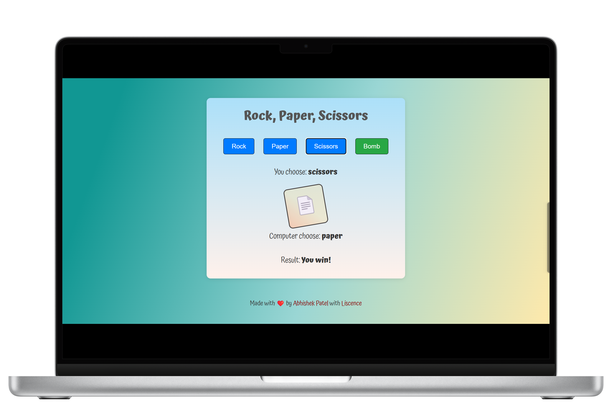

# RPS-Game



Rock, Paper, Scissors: A geek version of the classic game on GitHub

## 📝 Description

Rock, Paper, Scissors is a simple game that allows you to play against the computer. The game is played with three different options: Rock, Paper, and Scissors. The computer randomly selects one of these options and the player has to choose the same option. If the player wins, they get a point. If the computer wins, the player loses a point. If the game ends in a tie, both players get a point.

## 💻 Technologies

- HTML
- CSS
- JavaScript

## 📦 Installation

1. Clone the repository

```bash
git clone https://github.com/PatellAbhishekk/RPS-Game.git
```

2. Go to the directory

```bash
cd RPS-Game
```

3. Run the project  
   Open `index.html` in your browser

## 📄 License

[](https://raw.githubusercontent.com/PatellAbhishekk/RPS-Game/refs/heads/main/LICENSE)
